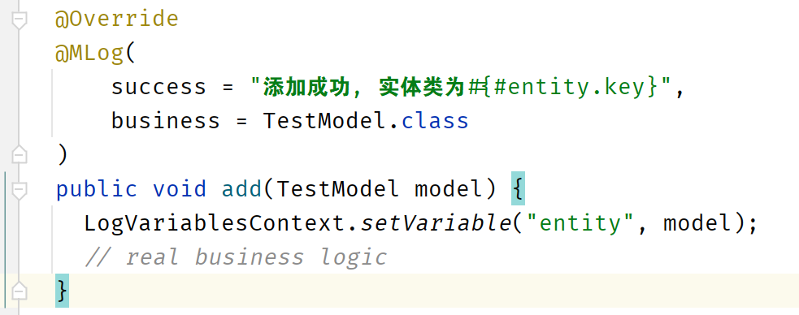
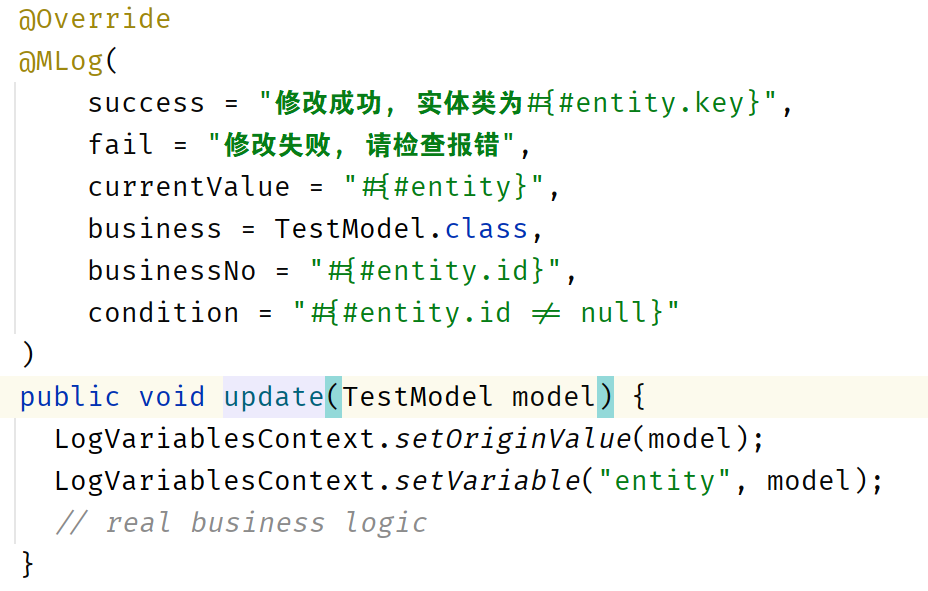

# <p align="center">🗊 MLog</a></p>


<p align="center">An open-source annotations-base log util for spring boot!</p>
<p align="center">开源、易用、基于注解、低入侵的日志组件</p>

<p align="center">
    <a href="./readme_zh_cn.md">中文文档</a>
</p>

<p align="center">
  <a href="https://github.com/MASIJUN99/MLog/stargazers"></a>
  <a href="https://github.com/MASIJUN99/MLog/stargazers"></a>

</p>

<p align="center">
  <a href="./sample">Sample</a> •
  Try to discuss in issue!
</p>

## Features

* Open-source component for spring boot
* Support public maven repo (TODO)
* Easy to customize, easy to use
* Low invasion of current code

## Use for Spring Boot

### clone code

Clone the code to local.

```shell
git clone https://github.com/MASIJUN99/MLog.git
```

### build for maven

build jar for maven uses.

```shell
cd MLog
maven clean compile deploy
```

### import for your project

reference for [IntelliJ IDEA](https://www.jetbrains.com/help/idea/2022.3/library.html).

## Contribute

Contribute makes open-source community which place to learn, create and inspire.

Any code you contributed will make this community better!

See more in [development guide](./development.md)

## SNAPSHOT





## License

## Reference

[如何优雅地记录操作日志？](https://mp.weixin.qq.com/s/JC51S_bI02npm4CE5NEEow)
