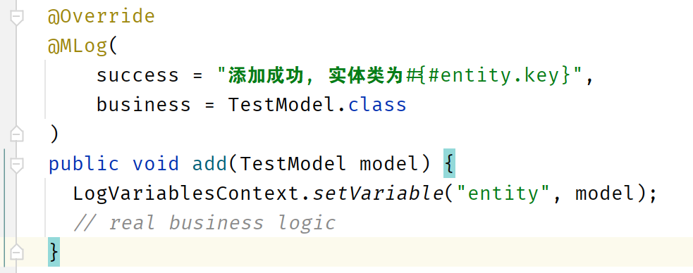

# <p align="center">🗊 MLog</a></p>


<p align="center">开源、易用、基于注解、低入侵的日志组件</p>
<p align="center">An open-source annotations-base log util for spring boot!</p>

<p align="center">
    <a href="./readme_zh_cn.md">英文文档</a>
</p>

<p align="center">
  <a href="https://github.com/MASIJUN99/MLog/stargazers"></a>
  <a href="https://github.com/MASIJUN99/MLog/stargazers"></a>

</p>

<p align="center">
  <a href="./sample">Sample</a> •
  欢迎提Issue
</p>

## 特性

* 开源的SpringBoot组件
* 支持Maven仓库拉取 (TODO)
* 易用、可定制开发
* 对现有代码入侵性低

## 通过SpringBoot使用

### 克隆代码

克隆代码到本地

```shell
git clone https://github.com/MASIJUN99/MLog.git
```

### 构建maven依赖

构建一个maven依赖

```shell
cd MLog
maven clean compile deploy
```

### 将依赖导入到现有代码

可以将其放入./m2/repository（不推荐）

或

IDEA用户可以参考 [IntelliJ IDEA](https://www.jetbrains.com/help/idea/2022.3/library.html).

## 贡献

谢谢GitHub给我带来的成长，我也愿意为开源社区的发展贡献自己的力量，我也非常希望向各位前辈学习，欢迎提交代码，我会认真查看学习的！

开发者请参考 [development guide](documents/development.md)

## 快照




## 开源协议

## 参考文献

[如何优雅地记录操作日志？](https://mp.weixin.qq.com/s/JC51S_bI02npm4CE5NEEow)

## 文档

[更新日志](documents/update_log.md)

[开发日志](documents/development_log.md)
